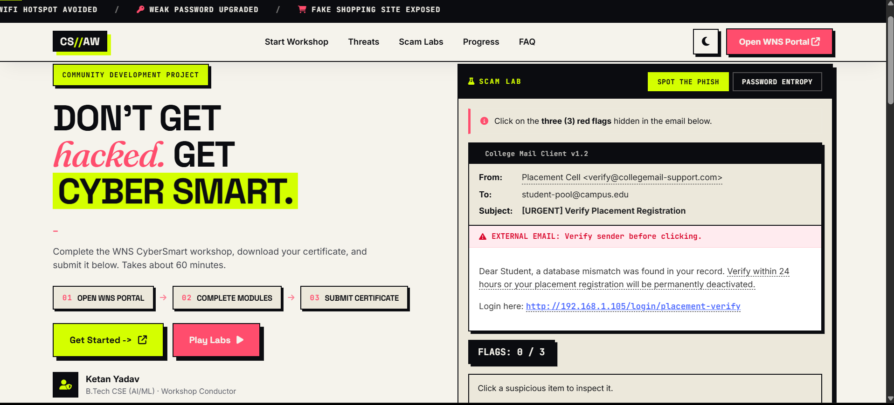
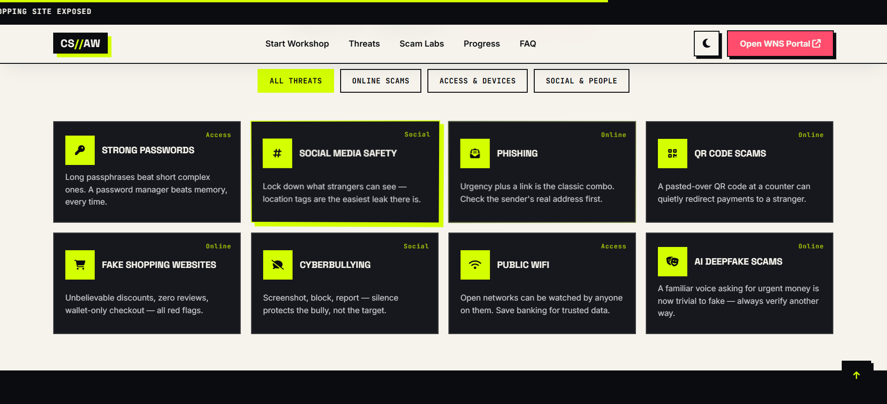
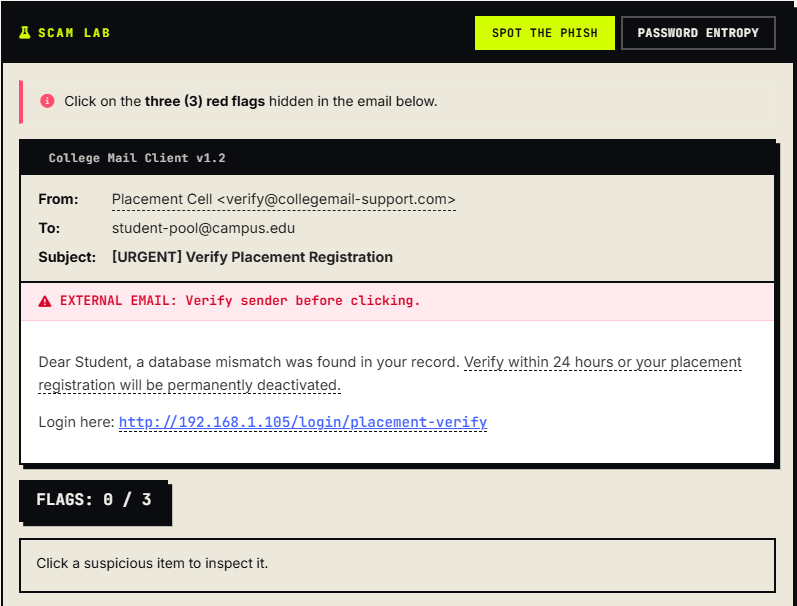
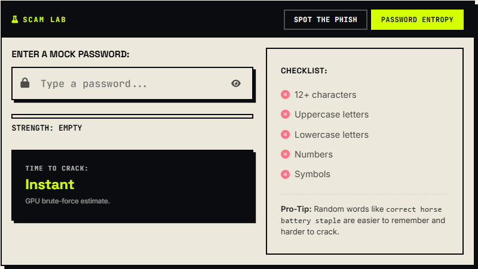
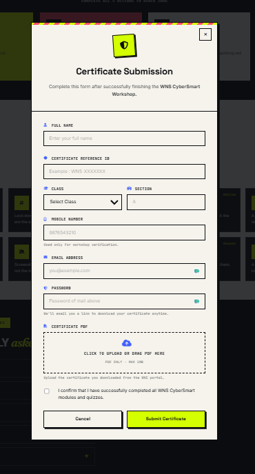

<div align="center">

# 🛡️ Cyber Security Awareness Workshop

### Interactive Cyber Security Awareness Platform built for a Community Development Project (CDP)

[]()
[]()
[]()
[]()

### 🌐 Live Demo

https://dev-ketan-1603.github.io/CDP-Website/

</div>

---

## 🎯 About the Project

This project was developed as part of a **Community Development Project (CDP)** to simplify the delivery of cybersecurity awareness workshops in schools.

The platform combines educational content, interactive scam labs, and certificate submission into a single, easy-to-use website. Students complete the official WNS CyberSmart workshop, explore common cyber threats through interactive activities, and submit their completion certificate—all without creating an account.

---

# 📸 Screenshots

## 🏠 Homepage



---

## 🛡️ Threat Explorer



---

## 🎣 Phishing Lab



---

## 🔐 Password Entropy Lab



---

## 📄 Certificate Submission

<p align="center">

</p>

---

# ✨ Features

- 🛡️ Interactive phishing email simulator
- 🔐 Live password strength & entropy checker
- 📚 Threat library covering common cyber scams
- 🎮 Hands-on scam labs for practical learning
- 📤 Certificate submission with PDF upload
- ☁️ Google Sheets + Google Drive integration
- 🌙 Dark / Light mode
- 📱 Fully responsive design
- ⚡ Smooth animations and modern Neo-Brutalist UI
- 🚀 GitHub Pages deployment

---

# 🛠️ Tech Stack

### Frontend

- HTML5
- CSS3
- JavaScript (Vanilla)

### Libraries

- AOS (Animate On Scroll)
- Vanilla-Tilt.js
- Typed.js
- Font Awesome

### Backend

- Google Apps Script
- Google Sheets
- Google Drive

---

# 📂 Project Structure

```text
.
├── images/
│   ├── home.png
│   ├── threats.png
│   ├── phishing-lab.png
│   ├── password-entropy.png
│   └── form.png
│
├── index.html
├── styles.css
├── script.js
├── apps-script-upload-addition.gs
└── README.md
```

---

# 🚀 Getting Started

Clone the repository

```bash
git clone https://github.com/dev-ketan-1603/CDP-Website.git
```

Open the project

```text
index.html
```

No build tools or installation required.

---

# ☁️ Certificate Submission Backend

Certificate submissions are powered by **Google Apps Script**, allowing students to upload their certificates without authentication.

## 1️⃣ Create a Google Sheet

Create a spreadsheet with the following columns:

```text
Timestamp | Name | Class | Section | Mobile | Reference | Certificate Link
```

---

## 2️⃣ Create a Google Drive Folder

Create a folder to store uploaded certificates and copy its **Folder ID** from the URL.

---

## 3️⃣ Configure Apps Script

Open:

```text
Extensions → Apps Script
```

Paste the contents of

```text
apps-script-upload-addition.gs
```

Update:

```javascript
const CERTIFICATE_FOLDER_ID = "YOUR_FOLDER_ID";
```

Make sure

```javascript
getSheetByName("Sheet1")
```

matches your sheet name.

---

## 4️⃣ Deploy

Deploy the script as a **Web App**

```text
Execute as:
Me

Who has access:
Anyone
```

Copy the deployment URL.

---

## 5️⃣ Connect the Frontend

Inside

```javascript
script.js
```

replace

```javascript
const SCRIPT_URL = "YOUR_WEB_APP_URL";
```

---

## 6️⃣ Test

Submit a sample certificate and verify:

- A new row is created in Google Sheets.
- The uploaded PDF appears in Google Drive.
- The Drive link is stored correctly.

---

# 🎨 Customization

Theme colors are controlled using CSS variables.

```css
:root{
  --volt:#D4FF00;
  --riot:#FF4D6D;
  --signal:#4361FF;
}
```

Changing these values will automatically re-theme the website.

---

# ⚠️ Known Limitations

- Duplicate submission prevention uses Local Storage only.
- No CAPTCHA or rate limiting.
- Maximum upload size is 5 MB.
- Google Apps Script request limits still apply.

---

# 🚀 Future Improvements

- Admin dashboard
- Workshop analytics
- Leaderboard
- Multi-language support
- Email confirmation after submission
- More interactive cyber security labs
- Progress tracking for students

---

# 👨‍💻 Author

**Ketan Yadav**

🎓 B.Tech CSE (AI/ML)

💻 Passionate about Full Stack Development & AI

GitHub:
https://github.com/dev-ketan-1603

---

# ⭐ Support

If you found this project useful, consider giving it a ⭐ on GitHub.

It helps others discover the project and motivates future improvements.
